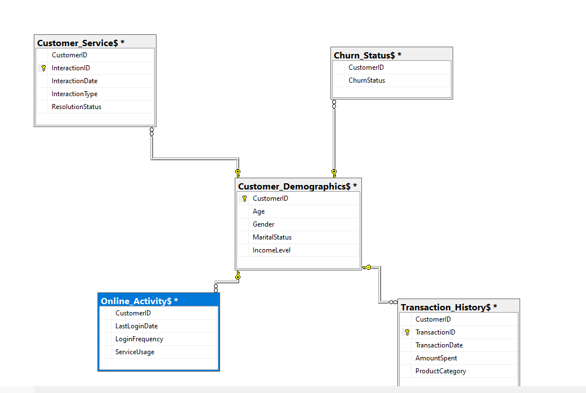
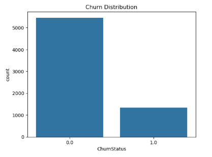
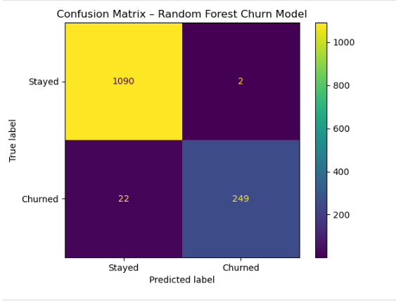
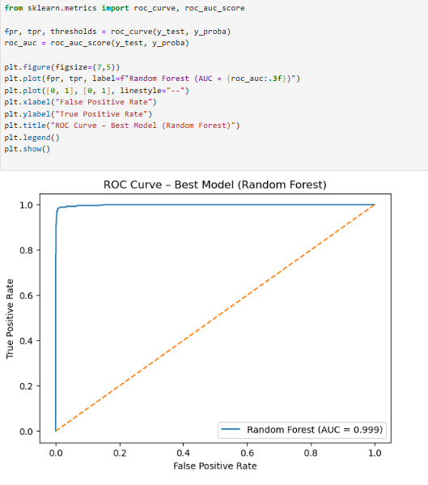
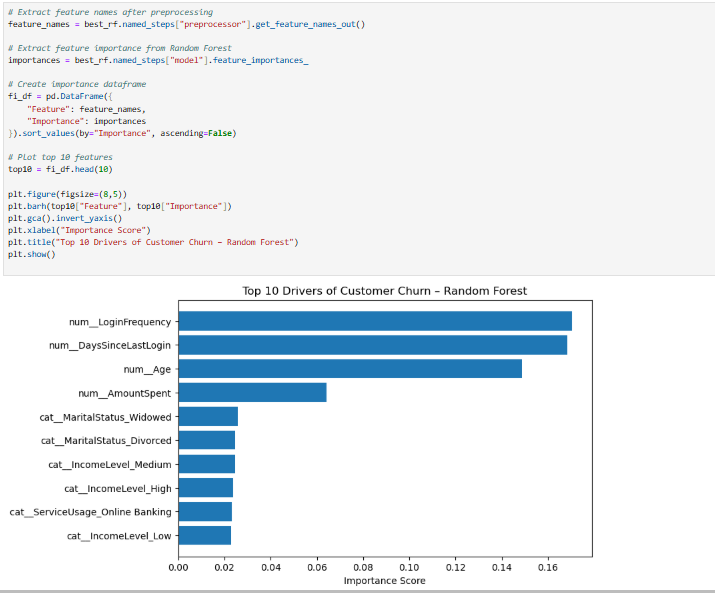

# 📊 Customer Churn Prediction & Retention Analytics  
**Case Study: Lloyds Banking Group**

---
**Screenshots:**  
  
  
  




## Executive Summary

This project focuses on predicting customer churn for a retail banking environment using historical customer interaction, transaction, and engagement data. The objective is to identify customers at high risk of leaving the bank and provide a data-driven foundation for proactive retention strategies.

The project follows an end-to-end analytics and machine learning workflow, starting from **data joining, cleaning, and exploration using SQL**, through **feature engineering and visualization in Python**, and culminating in **model development, evaluation, and optimization**.

Multiple machine learning models were trained and compared using business-relevant metrics, with **Random Forest** selected as the best-performing model based on **ROC-AUC and F1-score**, balancing churn detection accuracy and operational risk. Threshold tuning was applied to align the model with real-world banking decision-making.

This repository is structured to clearly demonstrate analytical thinking, technical rigor, and business relevance in a way that is accessible to both technical and non-technical stakeholders.

---

## 📁 Project Structure

```text
customer-churn-prediction-lloyds/
├── data/
│   └── raw/
│       └── customer_churn_data_large.csv
├── sql/
│   ├── Entity-Relationship Diagram
│   ├── lloyds_joins.sql
│   └── lloyds_eda_preprocess.sql
├── notebooks/
│   └── customer_churn_prediction_lloyds.ipynb
├── visuals/
│   ├── erd.png
│   ├── churn_distribution.png
│   ├── feature_engineering.png
│   ├── confusion_matrix.png
│   └── roc_curve.png
├── README.md
└── .gitignore

---
## Business Problem

Customer churn represents a direct revenue and relationship risk for banks. Acquiring new customers is significantly more expensive than retaining existing ones.  

**Goal:**  
Build a predictive model that accurately identifies customers likely to churn, enabling targeted retention actions before churn occurs.

**Target Variable:**  
- `ChurnStatus`  
  - `1` = Customer churned  
  - `0` = Customer stayed  

---

## Data Preparation & Processing

### 1. Data Joining & Cleaning (SQL)

- Multiple customer-related tables were **joined using SQL**
- Key actions performed:
  - Removal of duplicate records
  - Standardization of formats
  - Handling missing and inconsistent values
- SQL was chosen at this stage for:
  - Scalability
  - Data integrity
  - Efficient relational joins

---

### 2. Exploratory Data Analysis (EDA)

EDA was conducted to:
- Understand churn distribution
- Identify behavioral differences between churned and retained customers
- Detect data quality issues

Key analyses included:
- Churn rate by categorical variables
- Login behavior and recency patterns
- Engagement trends across customer segments

Visualizations were created using **Python (Matplotlib & Seaborn)** to support intuitive interpretation.

---

## Feature Engineering

Feature engineering was applied to convert raw data into meaningful predictors:

### Key Transformations

- **Dropped Unused Columns**
  - Identifiers and timestamps not useful for prediction:
    - `CustomerID`
    - `InteractionID`
    - `TransactionID`
    - `InteractionDate`
    - `TransactionDate`

- **Recency Feature Creation**
  - Converted `LastLoginDate` into:
    - `DaysSinceLastLogin`
  - This captures customer engagement freshness, a critical churn signal.

- **Missing Value Handling**
  - Categorical missing values replaced with empty strings
  - Numeric columns standardized to float format

- **Encoding & Scaling**
  - Categorical variables: One-Hot Encoding
  - Numerical variables: Standard Scaling

A **ColumnTransformer pipeline** ensured consistent preprocessing across all models.

---

## Model Development

### Train-Test Split

- 80% Training / 20% Testing
- Stratified split to preserve churn distribution

---

### Models Evaluated

The following models were trained using pipelines and GridSearchCV:

- Logistic Regression (class-weight balanced)
- Random Forest (class-weight balanced)
- Gradient Boosting
- Support Vector Machine
- XGBoost (with class imbalance handling)

---

### Why Multiple Models?

Using multiple models ensures:
- Robust comparison
- Reduced bias toward a single algorithm
- Selection of the most reliable model for business deployment

---

## Evaluation Metrics

Given the business cost of missing churners, accuracy alone was insufficient. The following metrics were used:

### Metrics Explained (Layman-Friendly)

- **ROC-AUC**
  - Measures how well the model separates churners from non-churners
  - Higher value = better ranking ability
  - Used as the primary model selection metric

- **Precision**
  - Of customers predicted to churn, how many actually churned
  - Important to avoid wasting retention resources

- **Recall**
  - Of all actual churners, how many were correctly identified
  - Critical in banking, as missed churners represent lost revenue

- **F1-Score**
  - Balance between Precision and Recall
  - Best overall indicator of churn model effectiveness

---

## Best Model Selection

### ✅ Selected Model: **Random Forest Classifier**

**Reason for Selection:**
- Highest ROC-AUC score among all models
- Strong F1-score performance
- Handles non-linear relationships effectively
- Robust to noise and feature interactions
- Provides feature importance for business interpretability

---

## Threshold Optimization

### Why Threshold Tuning?

- Default threshold (0.5) may not align with business priorities
- Banking retention strategies favor **higher recall** to catch more churners

### Approach

- Tested thresholds from `0.1` to `0.85`
- Selected threshold that maximized **F1-score**
- This improved balance between:
  - Capturing churners
  - Avoiding excessive false alarms

---

## Confusion Matrix Interpretation

**Random Forest – Final Model**

|                      | Predicted Stay | Predicted Churn |
|----------------------|---------------|-----------------|
| **Actual Stay**      | True Negatives | False Positives |
| **Actual Churn**     | False Negatives| True Positives  |

- **True Positives:** Correctly identified churners  
- **False Negatives:** Missed churners (highest business risk)  
- **False Positives:** Customers flagged but did not churn  

The optimized threshold reduced false negatives, aligning with retention goals.

---

## Feature Importance

Random Forest feature importance was extracted after preprocessing to identify key churn drivers.  
This enables:
- Business insight into churn behavior
- Targeted intervention strategies
- Model transparency for stakeholders

---

## Conclusion

This project successfully demonstrates a full-cycle churn analytics solution:
- Clean data foundation using SQL
- Strong exploratory analysis
- Thoughtful feature engineering
- Robust model comparison
- Business-aligned evaluation and optimization

The Random Forest model provides a reliable and interpretable framework for churn prediction in a banking context.

---

## Recommendations for Future Use

- Incorporate time-series behavior for deeper engagement trends
- Periodically retrain the model to reflect evolving customer behavior
- Combine churn predictions with customer lifetime value (CLV) for prioritization
- Explore explainability tools (e.g., SHAP) for regulatory transparency

---

## Key Skills Demonstrated

- SQL data preparation and joining  
- Python-based EDA and visualization  
- Feature engineering and transformation pipelines  
- Machine learning model selection and tuning  
- Business-driven evaluation and decision-making  

---

📌 *This repository is designed to be easily reviewed by both technical teams and banking recruiters, demonstrating practical, production-ready analytics skills.*
